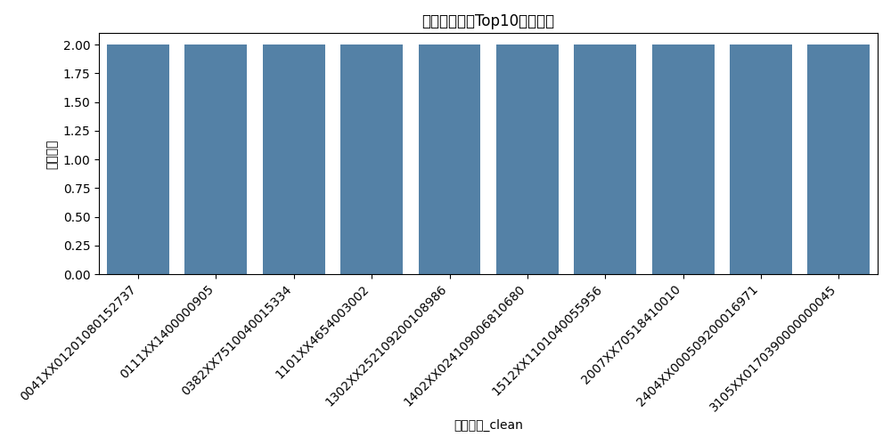
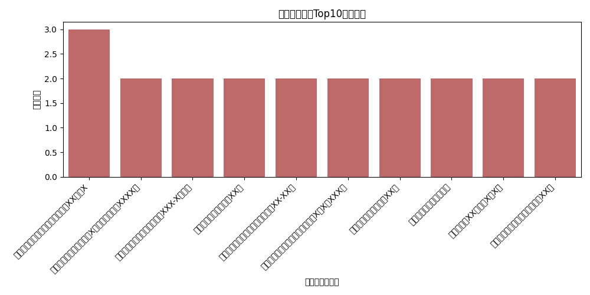

# Q1 利益冲突检测结果报告

本报告基于全量数据输出共享银行账号、注册地址、通讯地址与联系方式匹配结果，并生成可视化。

## 关键可视化
- 共享银行账号Top10：
- 共享注册地址Top10：
- 通讯地址（省-市）共享Top20：
- 共享联系方式类型分布：

## 部分结果展示

### 共享银行账号Top5（示例）

| 银行账号_clean        | vendors                  | names                                                |   n |
|:----------------------|:-------------------------|:-----------------------------------------------------|----:|
| 0041XX01201080152737  | ['V1408143', 'V1408043'] | ['新城XXXXXXXXXXXXXX中心', '广州XXXXXXXXXXXXXX贸行'] |   2 |
| 0111XX1400000905      | ['V1408138', 'V1710006'] | ['石家XXXXXXXXXXXXXX商店', '新华XXXXXXXXXXXXXX商店'] |   2 |
| 0382XX7510040015334   | ['V1407354', 'V1408383'] | ['上海XXXXXXXXXXXXXX公司', '上海XXXXXXXXXXXXXX公司'] |   2 |
| 1101XX4654003002      | ['V1408194', 'V1408036'] | ['深圳XXXXXXXXXXXXXX超市', '深圳XXXXXXXXXXXXXX超市'] |   2 |
| 1302XX252109200108986 | ['V1507346', 'V1608018'] | ['安徽XXXXXXXXXXXXXX公司', '合肥XXXXXXXXXXXXXX公司'] |   2 |

### 共享注册地址Top5（示例）

| 供应商注册地址                              | vendors                              | names                                                                          |   n |
|:--------------------------------------------|:-------------------------------------|:-------------------------------------------------------------------------------|----:|
| 广州市番禺区大龙街茶东村东兴路XX号之X       | ['V1407423', 'V1501031', 'V1511028'] | ['广州XXXXXXXXXXXXXX衣厂', '广州XXXXXXXXXXXXXX公司', '广州XXXXXXXXXXXXXX衣厂'] |   3 |
| 南宁市西乡塘区科德西路X号嘉士涌金广场XXXX号 | ['V1407732', 'V1407730']             | ['南宁XXXXXXXXXXXXXX营部', '南宁XXXXXXXXXXXXXX公司']                           |   2 |
| 安顺开发区西苑街新世纪小区XXX-X号商铺       | ['V1408462', 'V1408254']             | ['广西XXXXXXXXXXXXXX公司', '广西XXXXXXXXXXXXXX备）']                           |   2 |
| 南昌市东湖区青山南路XX号                    | ['V1407317', 'V1407192']             | ['南昌XXXXXXXXXXXXXX公司', '南昌XXXXXXXXXXXXXX中心']                           |   2 |
| 广东省东莞市虎门镇小捷滘捷南路XX-XX号       | ['V1407392', 'V1407246']             | ['东莞XXXXXXXXXXXXXX枫）', '广东XXXXXXXXXXXXXX公司']                           |   2 |

### 共享通讯地址Top10（示例）

数据缺失

### 共享联系方式类型计数

数据缺失

## 审计建议
- 对高频共享账号/地址进行主体穿透和实地核查，甄别壳公司或关联交易。
- 对联系方式匹配结果引入白名单（如总机/客服邮箱），降低误报。
