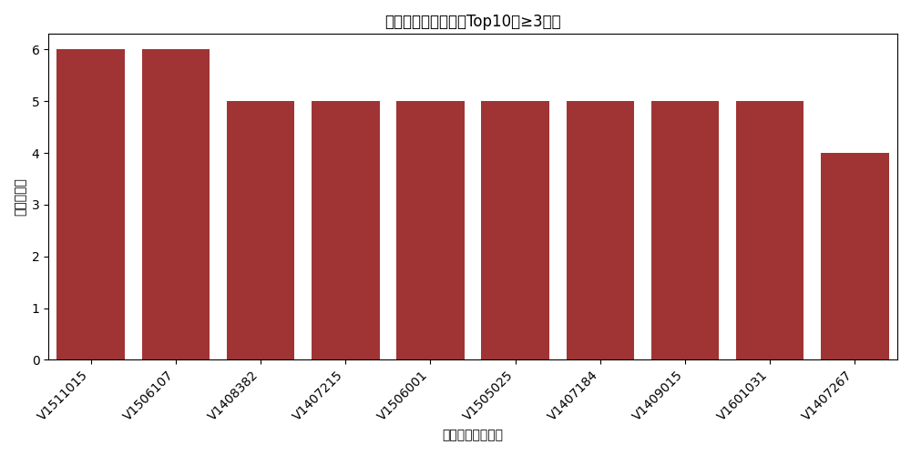
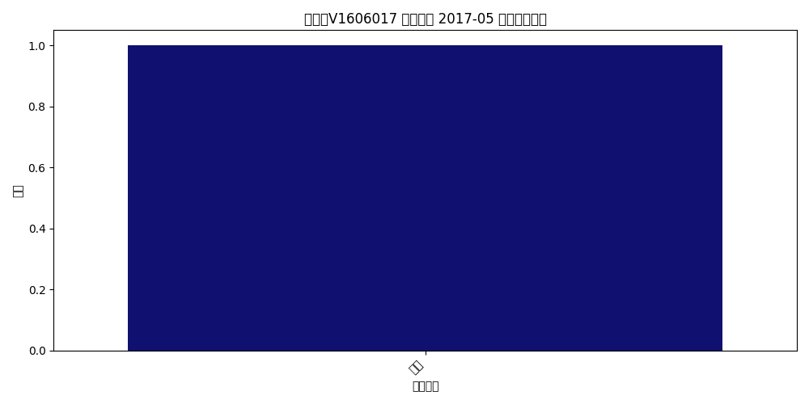

# Q2 采购金额激增异常结果报告

## 关键可视化
- 供应商异常月份计数Top10（≥3倍）：
- 示例异常月份的品类贡献占比：

## 统计概况
- ≥3倍异常月份数：632
- ≥5倍异常月份数：296

## 部分结果展示（≥3倍Top5）

| 新系统供应商编码   | _month   |   下单金额 |   prev3_mean |   spike_ratio |
|:-------------------|:---------|-----------:|-------------:|--------------:|
| V1606017           | 2017-05  |   236896   |        90.1  |      2629.26  |
| V1407215           | 2016-02  |   337020   |       806.64 |       417.807 |
| V1604005           | 2016-08  |    69017.3 |       206.17 |       334.759 |
| V1407496           | 2016-03  |   346484   |      1065    |       325.337 |
| V1709026           | 2017-10  |   288571   |       900    |       320.635 |

## 审计建议
- 对异常月份进行合同与审批穿透，关注集中采购与价格异常。
- 对季节性供应商采用季节性基线（同比），降低误报。
