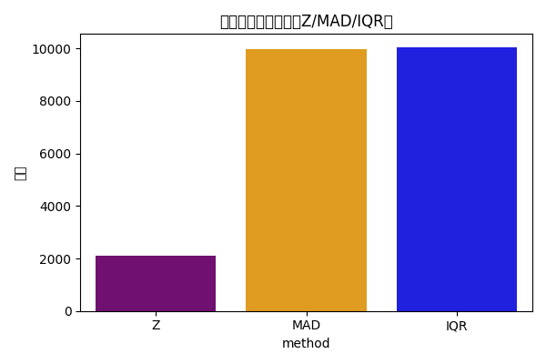
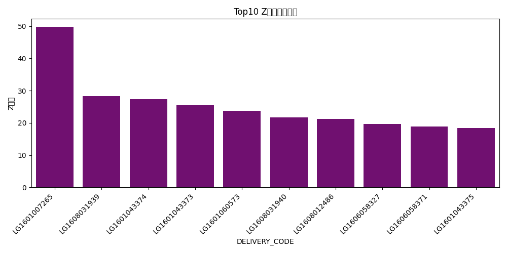

# Q3 销售订单金额异常结果报告

## 关键可视化
- 方法数量对比（Z/MAD/IQR）：
- Top10 Z分数异常订单：

## 统计概况
- Z分数异常：2100
- MAD异常：9990
- IQR异常：10050

## 部分结果展示（Z分数Top5）

| CUSTOMER_CODE   | DELIVERY_CODE   |   total_amount | order_date   |       z |
|:----------------|:----------------|---------------:|:-------------|--------:|
| C00707000       | LG1601007265    |         525000 | 2016-04-08   | 49.7757 |
| C00707000       | LG1608031939    |         300000 | 2016-08-23   | 28.3155 |
| C00707000       | LG1601043374    |         290000 | 2016-03-08   | 27.3617 |
| C00707000       | LG1601043373    |         270000 | 2016-03-08   | 25.4541 |
| C00707000       | LG1601060573    |         252000 | 2016-04-07   | 23.7373 |

## 审计建议
- 结合合同、折扣审批与发货签收，对异常订单进行穿透核查。
- 对客户分层与产品线拆解分析，识别政策偏离与异常定价。
