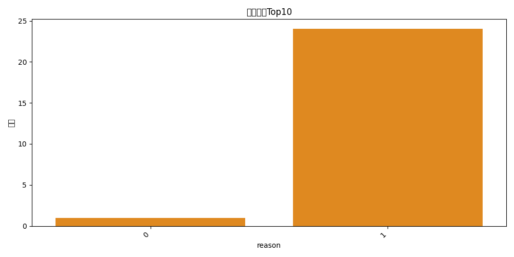
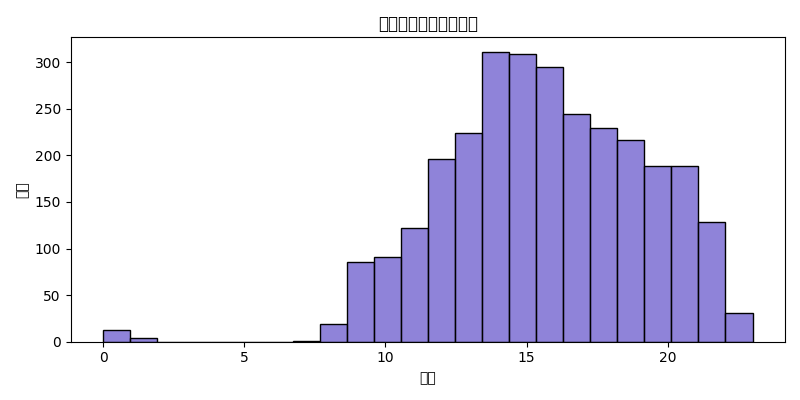

# Q4 POS/渠道异常结果报告

## 关键可视化
- 报废原因Top10：
- 异常交易小时分布：

## 统计概况
- 店间调拨：12
- 商品报废：25
- 含礼物交易：170
- 异常日期/时间：2896

## 部分结果展示（异常日期/时间Top5）

|   Transaction_ID | Trans_Date   | Trans_Start_Time   |   SUM_TRANS |   Discount_applied |   Discount_Rate |   Member_Ref |   Vol_of_prod |   Vol_of_distinct_prod |   ORIG_Transaction_ID |   Cash_related |   Non_Cash_related |   Gift_Certificate_related | Operator                                               |   Staff_Login |   TRANSACTION_TYPE_KNOWN |   in training |   selling |   IGNORE selling |   Transaction suspended |   Transaction obsolete |   reprint the receipt |   goods returned |   Gift_Welcome |   Gift_VIP |   Gift_Member |   Gift_General |   Gift_Valentine |   Gift_Autumn |   Gift_Summer |   Gift_Christmas |   Gift_Chocolate_ornament |   Gift_NewYear |   Gift_Spring |   Gift_FLAG |   Open_cashbox_withkey |   cash / bills into till |   Bulk Adjustments |   Order |   transfer confirm |   inter-store transfer |   Z report |   goods scrapped |   GOODS SCRAPPED_REASON |   electricity loss |   none business |   Clock in |   Clock out |   Register start up |   Register shut down |   Turn on training mode |   Turn off training mode |   Store reshipment |   Read Cash Register Accounts |   Transaction recovered | any_gift   |   hour |
|-----------------:|:-------------|:-------------------|------------:|-------------------:|----------------:|-------------:|--------------:|-----------------------:|----------------------:|---------------:|-------------------:|---------------------------:|:-------------------------------------------------------|--------------:|-------------------------:|--------------:|----------:|-----------------:|------------------------:|-----------------------:|----------------------:|-----------------:|---------------:|-----------:|--------------:|---------------:|-----------------:|--------------:|--------------:|-----------------:|--------------------------:|---------------:|--------------:|------------:|-----------------------:|-------------------------:|-------------------:|--------:|-------------------:|-----------------------:|-----------:|-----------------:|------------------------:|-------------------:|----------------:|-----------:|------------:|--------------------:|---------------------:|------------------------:|-------------------------:|-------------------:|------------------------------:|------------------------:|:-----------|-------:|
|                1 | 2014-04-06   | 14:31:08.0000000   |     -1010   |                  0 |             nan |          nan |             5 |                      5 |                     1 |              0 |                  1 |                          0 | 操作员编号          701 W Operator 2   收银机编号    1 |           701 |                        1 |             0 |         1 |                0 |                       0 |                      0 |                     1 |                0 |              0 |          0 |             0 |              0 |                0 |             0 |             0 |                0 |                         0 |              0 |             0 |           0 |                      0 |                        0 |                  0 |       0 |                  0 |                      0 |          0 |                0 |                       0 |                  0 |               0 |          0 |           0 |                   0 |                    0 |                       0 |                        0 |                  0 |                             0 |                       1 | False      |     14 |
|                2 | 2014-04-06   | 14:32:06.0000000   |       214.2 |                  0 |             nan |          nan |             1 |                      1 |                     2 |              0 |                  1 |                          0 | 操作员编号          701 W Operator 2   收银机编号    1 |           701 |                        1 |             0 |         0 |                0 |                       0 |                      0 |                     0 |                1 |              0 |          0 |             0 |              0 |                0 |             0 |             0 |                0 |                         0 |              0 |             0 |           0 |                      1 |                        0 |                  0 |       0 |                  0 |                      0 |          0 |                0 |                       0 |                  0 |               0 |          0 |           0 |                   0 |                    0 |                       0 |                        0 |                  0 |                             1 |                       0 | False      |     14 |
|                3 | 2014-04-06   | 14:45:42.0000000   |       -45   |                  0 |             nan |          nan |             1 |                      1 |                     3 |              1 |                  0 |                          0 | 操作员编号          701 W Operator 2   收银机编号    1 |           701 |                        1 |             0 |         1 |                0 |                       0 |                      0 |                     0 |                0 |              0 |          0 |             0 |              0 |                0 |             0 |             0 |                0 |                         0 |              0 |             0 |           0 |                      0 |                        0 |                  0 |       0 |                  0 |                      0 |          0 |                0 |                       0 |                  0 |               0 |          0 |           0 |                   0 |                    0 |                       0 |                        0 |                  0 |                             0 |                       0 | False      |     14 |
|                4 | 2014-04-06   | 14:46:25.0000000   |       -81.6 |                  0 |             nan |          nan |             1 |                      1 |                     4 |              1 |                  0 |                          0 | 操作员编号          701 W Operator 2   收银机编号    1 |           701 |                        1 |             0 |         1 |                0 |                       0 |                      0 |                     0 |                0 |              0 |          0 |             0 |              0 |                0 |             0 |             0 |                0 |                         0 |              0 |             0 |           0 |                      0 |                        0 |                  0 |       0 |                  0 |                      0 |          0 |                0 |                       0 |                  0 |               0 |          0 |           0 |                   0 |                    0 |                       0 |                        0 |                  0 |                             0 |                       0 | False      |     14 |
|                5 | 2014-04-06   | 14:47:28.0000000   |       -45   |                  0 |             nan |          nan |             1 |                      1 |                     5 |              1 |                  0 |                          0 | 操作员编号          701 W Operator 2   收银机编号    1 |           701 |                        1 |             0 |         1 |                0 |                       0 |                      0 |                     0 |                0 |              0 |          0 |             0 |              0 |                0 |             0 |             0 |                0 |                         0 |              0 |             0 |           0 |                      0 |                        0 |                  0 |       0 |                  0 |                      0 |          0 |                0 |                       0 |                  0 |               0 |          0 |           0 |                   0 |                    0 |                       0 |                        0 |                  0 |                             0 |                       0 | False      |     14 |

## 审计建议
- 结合门店营业时间与权限控制，核查异常时段交易的合规性。
- 对报废与礼物交易核对审批与促销政策匹配，关注超范围与非授权操作。
