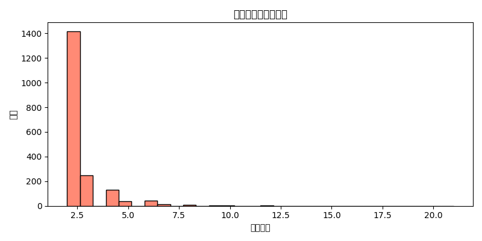
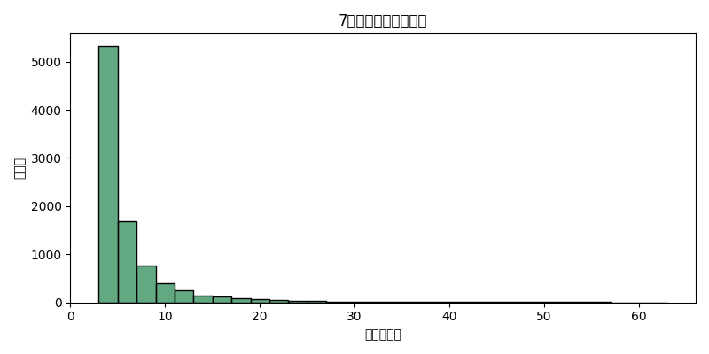
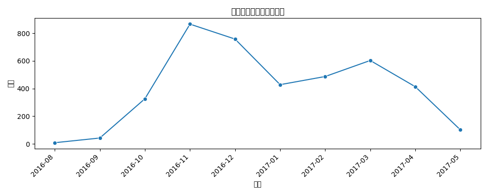

# Q5 差旅与费用报销异常结果报告

## 关键可视化
- 重复报销组次数分布：
- 7日窗口报销次数分布：
- 应收据未收到月度分布：

## 统计概况
- 重复报销组：1912
- 7日窗口≥3次：9128
- 收据缺失：4032
- 提交晚于付款：3

## 部分结果展示（重复组Top5）

|   EmployeeID | Vendor       | TxnDate    | ExpenseType     |   Txn_Amt |   count |
|-------------:|:-------------|:-----------|:----------------|----------:|--------:|
|    152021006 | 北京XXXX公司 | 2016-10-29 | HCP Car Service |     600   |      21 |
|    200000903 | 北京XXXX公司 | 2017-03-20 | HCP Car Service |     400   |      14 |
|    152023287 | 中国XXXX铁路 | 2017-04-08 | HCP Train       |     128.5 |      12 |
|    200001112 | 沈阳XXXX租车 | 2016-11-19 | HCP Taxi        |     120   |      12 |
|    152022271 | 北汽XXXX集团 | 2016-11-18 | HCP Taxi        |     300   |      12 |

## 审计建议
- 对重复与反复性报销结合票据影像与业务单据穿透，识别拆分与同票多报。
- 强化流程执行，减少收据缺失与提交/付款时序异常。
